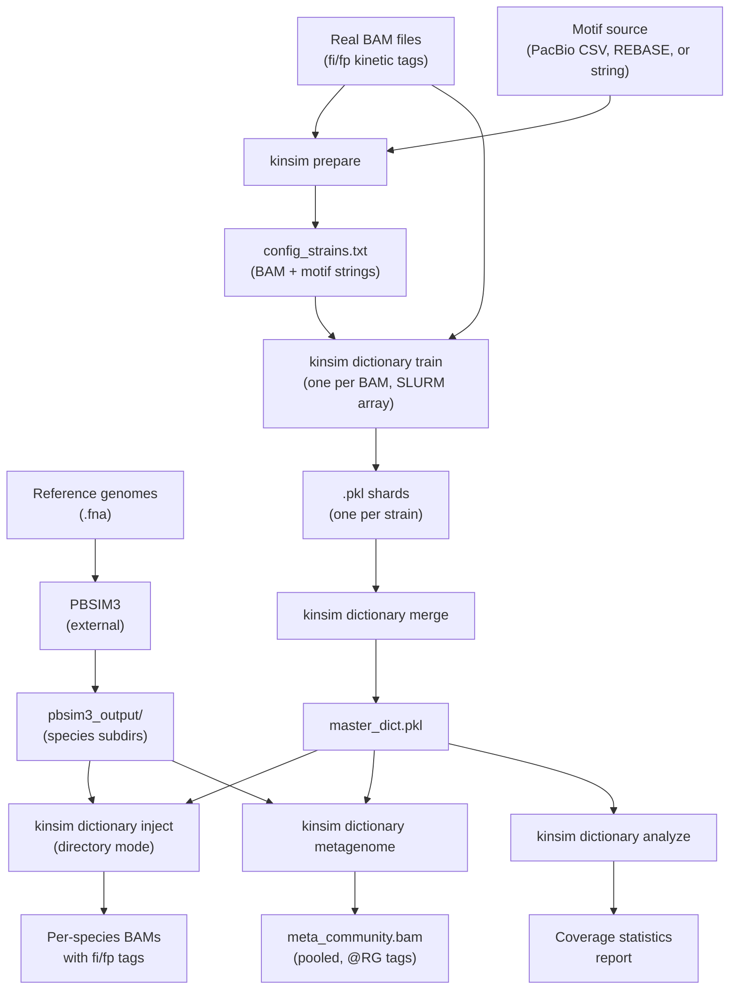
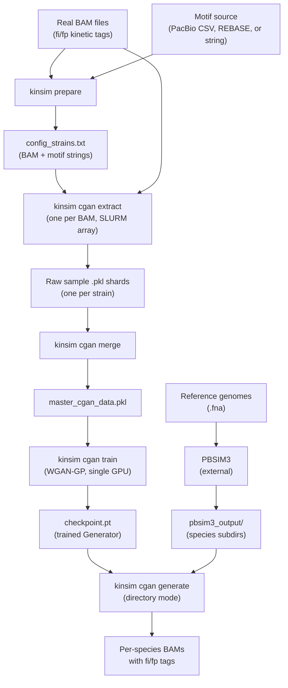
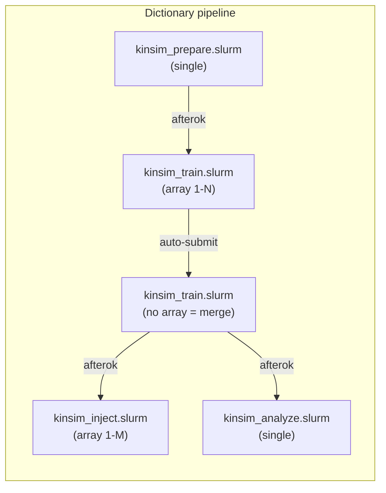
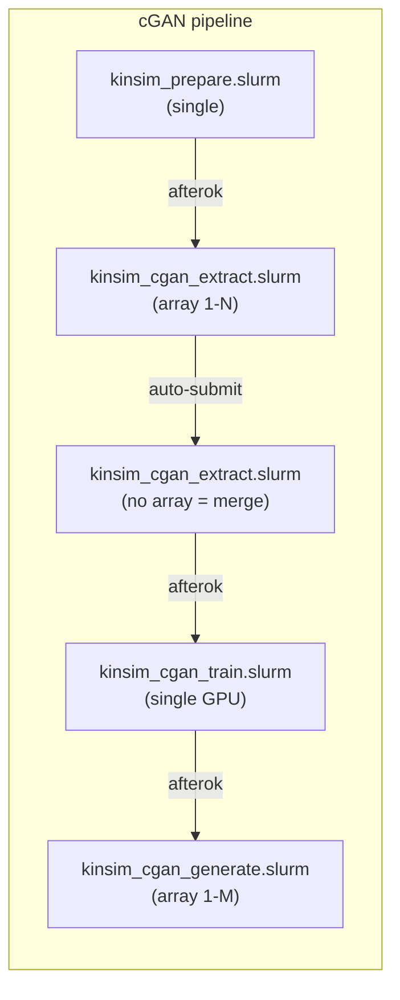

# KinSim

<p align="center">
  
</p>

**PacBio kinetic signal simulator for metagenomic binning.**

KinSim learns species-specific IPD/PW distributions from real PacBio SMRT sequencing data, then injects realistic kinetic signals into synthetic reads generated by PBSIM3. The goal: prove that methylation-derived kinetic signatures improve metagenomic binning.

## How it works

PacBio sequencing captures two kinetic signals at every base: **IPD** (Inter-Pulse Duration) and **PW** (Pulse Width). These signals vary depending on the local sequence context (11-mer) and DNA methylation state. KinSim exploits this by:

1. **Training** a model from real BAM files — learning the statistical distribution of IPD/PW for each 11-mer + methylation state.
2. **Injecting** sampled signals onto PBSIM3 synthetic reads, using the reference genome to resolve context for edge bases.

Two generation modes are available:

| Mode | Status | Method |
|---|---|---|
| **Dictionary** | Implemented | Gaussian sampling from per-kmer accumulators |
| **cGAN** | Implemented | Conditional WGAN-GP for non-Gaussian distributions |

Both modes share the same **prepare** step and motif format.

### Context design note

For the first and last 5 bases of each simulated read, the polymerase in reality traverses the full 11-mer genomic context even though those flanking bases are absent from the read sequence.  KinSim therefore fetches 5 extra bases on each side from the reference genome (via the PBSIM3 `.maf` alignment), ensuring that every base position receives an accurate kinetic signal.  This is biologically correct: the methylation state of the DNA template determines the kinetics, regardless of what portion of the read is reported.

### Pipeline overview (dictionary mode)



### Pipeline overview (cGAN mode)



## Installation

### Option A: Install as a package (recommended)

```bash
git clone https://github.com/<user>/KinSim.git
cd KinSim
pip install -e .
```

After installing, the `kinsim` command is available from anywhere:

```bash
kinsim prepare ...
kinsim dictionary train ...
```

### Option B: Run without installing

```bash
git clone https://github.com/<user>/KinSim.git
cd KinSim
pip install numpy pysam
```

All commands must be run **from the repository root** (`KinSim/`) using `python -m kinsim`:

```bash
cd /path/to/KinSim
python -m kinsim prepare ...
python -m kinsim dictionary train ...
```

### Help

All commands support `-h` for detailed usage:
```bash
kinsim -h
kinsim prepare -h
kinsim motifs -h
kinsim rebase -h
kinsim rebase parse -h
kinsim rebase patterns -h
kinsim dictionary -h
kinsim dictionary train -h
kinsim dictionary merge -h
kinsim dictionary inject -h
kinsim dictionary metagenome -h
kinsim dictionary analyze -h
kinsim cgan -h
kinsim cgan extract -h
kinsim cgan merge -h
kinsim cgan train -h
kinsim cgan generate -h
```

### Optional dependencies

- **cGAN mode**: `pip install -e .[cgan]` — Adds PyTorch (>=2.0) and TensorBoard
- **Cluster config**: `pip install -e .[cluster]` — Adds PyYAML
- **FuzzNuc** (recommended): install [EMBOSS](https://emboss.sourceforge.net/) for the primary reference scanning backend. KinSim falls back to Python regex automatically if not installed. Use `--no-fuzznuc` to force regex mode.

---

## Part 1 - Shared tools (all modes)

### Motif sources (auto-detected everywhere)

All tools that accept a `motifs` argument support three interchangeable formats, auto-detected at runtime:

| Source | Detection | Description |
|--------|-----------|-------------|
| **PacBio motifs.csv** | file ending in `.csv` | SMRT Link output, filtered by `--min-fraction` / `--min-detected` |
| **REBASE file** | any other file path | Simplified two-column or Format #19 (withrefm) - auto-detected |
| **KinSim string** | not a file path | `"m6A,GATC,1;m4C,CCWGG,1"` - used as-is |

### REBASE format

KinSim supports two REBASE input formats, auto-detected from file content:

**Simplified two-column format:**
```
# recognition_seq   methylation_sites
GATC                2(6)          # m6A at 1-based position 2 of GATC
CCWGG               2(5)          # m5C at position 2
GCWGC               2(6),-1(6)    # m6A top-strand pos 2, also bottom-strand pos 1
```

**REBASE Format #19 (withrefm / allenz-style):**
```
ID   M.EcoRI
ET   M2
OS   Escherichia coli
RS   GAATTC, ?;
MS   2(6mA);
//
```

X(Y) position notation (both formats):
- **X** = 1-based position within the recognition sequence
  - Positive X -> forward strand; negative X -> complementary strand from its 5' end
  - Conversion: positive X -> `pos = X-1` (0-based); negative X -> `pos = len(seq)-|X|`
- **Y** (simple format) = `6` (m6A), `5` (m5C), `4` (m4C)
- **type** (Format #19 MS field) = `6mA`, `5mC`, `N4mC`
- Multiple sites per motif -> separate with commas: `2(6),-1(4)`
- Records with `?` in RS or MS are skipped

Download REBASE data from ftp://ftp.neb.com/pub/rebase/ (withrefm files are Format #19).

### Parsing REBASE files directly

```bash
# Parse a REBASE file (auto-detects simplified or Format #19) -> KinSim motif string
kinsim rebase parse /path/to/withrefm.txt

# Convert any motif source to a fuzznuc @pattern file (for external use)
kinsim rebase patterns /path/to/withrefm.txt patterns.txt
kinsim rebase patterns /path/to/motifs.csv  patterns.txt
kinsim rebase patterns "m6A,GATC,1;m4C,CCWGG,1" patterns.txt
```

### Prepare: parse motif sources into config

Create an input file listing BAM / motif-source pairs (alternating lines):
```
/path/to/strain1.bam
/path/to/strain1/motifs.csv
/path/to/strain2.bam
/path/to/strain2/rebase_motifs.txt
```

Parse it:
```bash
kinsim prepare pairs.txt config_strains.txt
```

This resolves all motif sources, filters PacBio CSV entries (`fraction >= 0.40`, `nDetected >= 20`), and outputs:
```
/path/to/strain1.bam
m6A,GCCGATC,5,3551,0.998;m6A,CTGAAG,5,2891,1.0
/path/to/strain2.bam
m6A,GATC,1;m6A,GCWGC,1
```

Parse a single motif source:
```bash
kinsim motifs /path/to/motifs.csv          # PacBio CSV
kinsim motifs /path/to/rebase.txt          # REBASE file
kinsim motifs "m6A,GATC,1;m4C,CCWGG,1"   # inline string
```

### Motif string format (internal)

Semicolon-delimited entries: `MOD_TYPE,IUPAC_MOTIF,POS[,nDetected[,fraction]]`

```
m6A,GCCGATC,5,3551,0.998;m4C,CCWGG,1,922,0.92;m5C,RGATCY,4,1138,0.76
```

- **MOD_TYPE**: `m6A`, `m4C`, or `m5C`
- **IUPAC_MOTIF**: supports ambiguity codes (R, Y, W, S, K, M, B, D, H, V, N)
- **POS**: 0-based position of modified base within the motif
- **nDetected**: optional 4th field (PacBio CSV only); used by cGAN mode for weighting
- **fraction**: optional 5th field (PacBio CSV only); preserved for traceability, not used by pipeline logic

Both forward and reverse-complement strands are scanned automatically.

---

## Part 2 - Dictionary mode

The dictionary mode uses a statistical approach: for each 11-mer + methylation state, it stores a running accumulator `[n, sum_ipd, sum_ipd2, sum_pw, sum_pw2]` from which mean and variance are derived. Signal injection samples from a Gaussian distribution.

### Train: build the kinetic dictionary

```bash
# Single BAM -> one shard (motifs auto-detected: string, CSV, or REBASE file)
kinsim dictionary train reads.bam \
    "m6A,GCCGATC,5,3551;m6A,CTGAAG,5,2891" output.pkl

# Using a PacBio motifs.csv directly
kinsim dictionary train reads.bam /path/to/motifs.csv output.pkl

# Using a REBASE file
kinsim dictionary train reads.bam /path/to/rebase.txt output.pkl

# Merge all shards into master dictionary
kinsim dictionary merge /path/to/shards/ master_dict.pkl
```

### Inject: paint signals onto synthetic reads

Two modes - auto-detected by whether the first argument is a directory:

#### Directory mode (recommended - process all species at once)

```bash
# Species-subdirectory layout (created by pbsim3_simulate.slurm):
#   pbsim3_output/
#     Ecoli/         reads.fq.gz  reads.maf.gz  Ecoli.fna
#     Salmonella/    reads.fq.gz  reads.maf.gz  Salmonella.fna
kinsim dictionary inject pbsim3_output/ master_dict.pkl \
    "m6A,GCCGATC,5,3551" injected/

# Flat layout (all files in one dir, matched by basename):
#   pbsim3_output/  Ecoli.fq.gz  Ecoli.maf.gz  Ecoli.fna  ...
kinsim dictionary inject pbsim3_output/ master_dict.pkl \
    /path/to/motifs.csv injected/

# Per-species motifs file (lines: "Ecoli|m6A,GATC,1"):
kinsim dictionary inject pbsim3_output/ master_dict.pkl \
    species_motifs.txt injected/
```

Output: one `<species>_kinsim.bam` per species in `injected/`.

#### Per-genome mode (single species)

```bash
kinsim dictionary inject \
    reads.fq.gz reads.maf.gz ref.fna master_dict.pkl \
    "m6A,GCCGATC,5,3551" output.bam
```

**Options:** `--linear` (non-circular genomes), `--no-fuzznuc` (force regex), `--no-revcomp`.

### Metagenome mode: pool all species into one BAM

For metagenomic binning experiments, pool all species into a single BAM with `@RG` (read group) tags. The dictionary is loaded **once** for all species.

Required directory structure (one subdirectory per species):
```
metagenome_root/
  Ecoli/
    genome.fna        <- reference genome (.fna / .fa / .fasta)
    reads.fq.gz       <- PBSIM3 simulated reads
    reads.maf.gz      <- PBSIM3 alignment
    motifs.csv        <- PacBio motif summary
  Salmonella/
    genome.fna
    reads.fq.gz
    reads.maf.gz
    motifs.csv
```

```bash
kinsim dictionary metagenome metagenome_root/ master_dict.pkl output/
```

Output: `output/meta_community.bam` - queryname-sorted BAM with `fi`/`fp` tags and `RG:Z:Ecoli`, `RG:Z:Salmonella` etc. on each read.

**Options:**
- `--linear` - treat genomes as linear
- `--no-fuzznuc` - force Python regex
- `--keep-species` - keep per-species intermediate BAMs (deleted by default)
- `--min-fraction` / `--min-detected` - filter thresholds for `motifs.csv` (defaults: 0.40 / 20)

**Next steps for binning:**
```bash
# 1. Align to a concatenated reference catalog
minimap2 -a -x map-hifi catalog.fna meta_community.bam | samtools sort -o aligned.bam
# 2. Index
samtools index aligned.bam
# 3. Bin with MetaBAT2 or SemiBin
```

### Analyze: inspect dictionary coverage

```bash
kinsim dictionary analyze master_dict.pkl
```

Reports per-methylation-state: % of 4^11 possible 11-mers covered, mean/median/min/max sample counts.

---

## Part 3 - cGAN mode

Uses a Conditional Wasserstein GAN with Gradient Penalty (WGAN-GP) to generate kinetic signals for non-Gaussian distributions. The Generator learns the full IPD/PW distribution per 11-mer context, conditioned on kmer and methylation state.

### Architecture
- **Model**: WGAN-GP with conditional embeddings
- **Generator**: [noise(32) + kmer_embed(64) + meth_embed(8)] -> 128 -> 128 -> 2 (IPD, PW)
- **Discriminator**: [signal(2) + kmer_embed(64) + meth_embed(8)] -> 128 -> 128 -> 1
- **Training**: Adam (beta=0.0, 0.9), n_critic=5, lambda_GP=10, batch_size=4096
- **Transform**: Log1p for training stability, expm1 for generation
- **Memory**: ~1 GB (64-dim embeddings), ~0.5 GB with `--kmer-embed-dim 32`

### Extract: collect raw samples from BAM files

Unlike dictionary mode (which stores running accumulators), cGAN mode collects **raw (IPD, PW) observations** per 11-mer context. These are needed to train the conditional generator on the full distribution shape.

```bash
# Single BAM -> one shard (motifs auto-detected)
kinsim cgan extract reads.bam \
    "m6A,GCCGATC,5,3551;m6A,CTGAAG,5,2891" output_cgan.pkl \
    --max-samples 10000

# Using a PacBio motifs.csv
kinsim cgan extract reads.bam /path/to/motifs.csv output_cgan.pkl

# Merge all shards into master training set
kinsim cgan merge /path/to/shards/ master_cgan_data.pkl \
    --max-samples 50000
```

Add `--no-revcomp` if your motif source already includes both forward and reverse complement motifs (e.g., from PacBio CSV with `partnerMotifString` column).

### Train: WGAN-GP training

Train the conditional GAN on the merged dataset:

```bash
kinsim cgan train master_cgan_data.pkl ./checkpoints/ \
    --epochs 100 \
    --batch-size 4096 \
    --kmer-embed-dim 64 \
    --device cuda

# Resume from checkpoint
kinsim cgan train master_cgan_data.pkl ./checkpoints/ \
    --resume ./checkpoints/checkpoint_epoch50.pt
```

Training outputs:
- `model_config.json` - Architecture hyperparameters
- `checkpoint_epoch{N}.pt` - Model weights + optimizer state
- `runs/` - TensorBoard logs (or `training_log.csv` if TensorBoard unavailable)

Monitor with TensorBoard:
```bash
tensorboard --logdir ./checkpoints/runs
```

### Generate: inject GAN-sampled signals into reads

Two modes - auto-detected by whether the first argument is a directory:

#### Directory mode

```bash
kinsim cgan generate pbsim3_output/ ./checkpoints/checkpoint_epoch100.pt \
    "m6A,GCCGATC,5,3551" generated/ \
    --device cuda --batch-reads 1000
```

Output: one `<species>_cgan.bam` per species in `generated/`.

#### Per-genome mode (single species)

```bash
kinsim cgan generate \
    reads.fq.gz reads.maf.gz ref.fna \
    ./checkpoints/checkpoint_epoch100.pt \
    "m6A,GCCGATC,5,3551" output.bam \
    --device cuda --batch-reads 1000
```

**Options:** `--linear`, `--no-fuzznuc`, `--no-revcomp`, `--device cpu` (if no GPU), `--batch-reads N`.

Like `dictionary inject`, this uses the MAF alignment and pre-computes reference methylation positions once before processing any reads.

---

## FuzzNuc integration (EMBOSS)

KinSim uses [EMBOSS](https://emboss.sourceforge.net/) `fuzznuc` as the **primary** reference-genome methylation scanner. It is recommended but not required - KinSim falls back to pure-Python regex automatically.

**Why fuzznuc is the primary backend:**
- **Native IUPAC support** - handles all ambiguity codes (R, Y, W, S, K, M, B, D, H, V, N) natively
- **Scientific credibility** - EMBOSS is an established, published bioinformatics suite
- **C-optimized performance** - significantly faster than pure-Python regex on large genomes

**Architecture:**
- `fuzznuc` is called **once** per reference genome with a named pattern file (`@patterns.txt`)
- All motifs are scanned in a single subprocess call (not one per motif)
- GFF output is parsed; pattern names in the attributes column identify which motif matched and at what offset
- Strand-aware position arithmetic: `+` strand -> `meth_pos = (Start-1) + mod_pos`; `-` strand -> `meth_pos = (End-1) - mod_pos`
- Regex is used as automatic fallback, and always for per-read scanning during training

**Install EMBOSS:**
```bash
# Ubuntu / Debian
sudo apt install emboss

# Conda
conda install -c bioconda emboss
```

**Usage:**
```bash
# fuzznuc is used by default (falls back to regex automatically if not installed)
kinsim dictionary inject pbsim3_output/ dict.pkl "m6A,GATC,1" out/

# Force Python regex (e.g. on a cluster without EMBOSS, or for debugging)
kinsim dictionary inject ... --no-fuzznuc
kinsim cgan generate      ... --no-fuzznuc
```

**Generate a fuzznuc pattern file for external use:**
```bash
kinsim rebase patterns "m6A,GATC,1;m4C,CCWGG,1" patterns.txt
# Then: fuzznuc -sequence genome.fa -pattern @patterns.txt -rformat gff -outfile hits.gff
```

---

## SLURM (HPC cluster)

All SLURM scripts are in `slurm_kinsim/`. Logs are written to `/data/projects/p774_MARSD/NDutilleux/logs/`.

### Step 0: Simulate reads with PBSIM3

Before running KinSim injection, generate synthetic reads with PBSIM3. The SLURM script creates one species subdirectory per genome, matching the input format expected by `kinsim dictionary inject` and `kinsim dictionary metagenome`:

```bash
# Count genomes
N=$(ls genomes/*.fna | wc -l)

# Run PBSIM3 (one array task per genome)
sbatch --array=1-${N} slurm_kinsim/pbsim3_simulate.slurm \
    genomes/ pbsim3_output/ /path/to/QSHMM-PACBIO-CCS.model
```

This creates:
```
pbsim3_output/
  Ecoli/
    genome.fna      reads.fq.gz   reads.maf.gz
  Salmonella/
    genome.fna      reads.fq.gz   reads.maf.gz
```

Then place a `motifs.csv` in each species subdirectory before running metagenome mode.

### Quick start - full pipeline in one command

```bash
# Dictionary mode (53 strains, 10 genomes to inject)
bash slurm_kinsim/kinsim_pipeline.sh dictionary \
    pairs.txt 53 config_strains.txt \
    shards/ master_dict.pkl \
    pbsim3_output/ "m6A,GATC,1;m4C,CCWGG,1" 10 injected/

# cGAN mode (53 strains, 10 genomes to generate, default 100 epochs)
bash slurm_kinsim/kinsim_pipeline.sh cgan \
    pairs.txt 53 config_strains.txt \
    cgan_shards/ master_cgan_data.pkl \
    pbsim3_output/ "m6A,GATC,1;m4C,CCWGG,1" 10 generated/ \
    checkpoints/
```

`kinsim_pipeline.sh` is run from the **login node** (not submitted). It uses `sbatch --parsable` and `--dependency=afterok` to chain all steps automatically.

### Dictionary pipeline - step by step

```bash
# Step 1: Prepare - resolve all motif sources into a compact config
sbatch slurm_kinsim/kinsim_prepare.slurm pairs.txt config_strains.txt

# Step 2: Train shards (array, one task per BAM)
# The last array task auto-submits the merge job — no second command needed.
sbatch --array=1-53 \
    slurm_kinsim/kinsim_train.slurm config_strains.txt shards/ master_dict.pkl

# Step 3: Inject signals (array, one task per genome)
# Run after merge completes. Auto-detects flat / species-subdir layout.
sbatch --array=1-10 \
    slurm_kinsim/kinsim_inject.slurm \
    pbsim3_output/ master_dict.pkl "m6A,GATC,1;m4C,CCWGG,1" injected/

# Step 4: Analyze dictionary coverage (optional, single job)
sbatch slurm_kinsim/kinsim_analyze.slurm master_dict.pkl
```

### cGAN pipeline - step by step

```bash
# Step 1: Prepare
sbatch slurm_kinsim/kinsim_prepare.slurm pairs.txt config_strains.txt

# Step 2: Extract raw samples (array, one task per BAM)
# The last array task auto-submits the merge job.
sbatch --array=1-53 \
    slurm_kinsim/kinsim_cgan_extract.slurm config_strains.txt cgan_shards/ master_cgan_data.pkl

# Step 3: Train the GAN (single GPU; --epochs, --resume, etc. passed through)
sbatch slurm_kinsim/kinsim_cgan_train.slurm master_cgan_data.pkl checkpoints/ --epochs 100

# Step 4: Generate signals (array, one task per genome)
sbatch --array=1-10 \
    slurm_kinsim/kinsim_cgan_generate.slurm \
    pbsim3_output/ checkpoints/checkpoint_epoch100.pt \
    "m6A,GATC,1;m4C,CCWGG,1" generated/
```

### SLURM dependency chains





> **Note on auto-submit:** When running standalone (`sbatch --array=1-N ...`), the last array task automatically submits the merge job. When using `kinsim_pipeline.sh`, `KINSIM_NO_AUTOMERGE=1` is set to suppress this, and the pipeline script submits the merge explicitly to obtain its job ID for dependency chaining.

To merge two existing master dictionaries (e.g. adding new training data):
```bash
kinsim dictionary merge dir_with_both_pkls/ combined_master.pkl
```

### Memory usage (dictionary mode)

| Step | Peak RAM | What dominates |
|---|---|---|
| Train | 1-2 GB | Dictionary growth (reads streamed via pysam) |
| Merge | 2-3 GB | Master dictionary in memory |
| Inject | 2-4 GB | Dictionary (~260 bytes/entry x millions of entries) |
| Analyze | 1-2 GB | Dictionary loaded for stats |

---

## Repository structure

```
kinsim/                     Python package
  __main__.py               CLI entry point (kinsim <command>)
  encoding.py               Shared: 22-bit kmer encoding, accumulator stats
  motifs.py                 Shared: IUPAC/CSV parsing, regex (per-read) + fuzznuc (reference)
  rebase_parser.py          Shared: REBASE Format #19 + simplified parser, fuzznuc pattern file
  prepare.py                Shared: BAM + motif-source pairs -> config file
  dictionary/               Dictionary mode
    train.py                Build dictionary from BAM + merge shards
    inject.py               Inject signals (directory, per-genome, and metagenome modes)
    analyze.py              Dictionary coverage statistics
  cgan/                     cGAN mode
    parse_train.py          Extract raw samples + merge shards
    model.py                Generator + Discriminator (WGAN-GP)
    train.py                WGAN-GP training loop with TensorBoard
    generate.py             GAN-based signal injection (directory + per-genome modes)

slurm_kinsim/               SLURM job scripts
  kinsim_pipeline.sh        General: full pipeline with dependency chain (login node)
  pbsim3_simulate.slurm     PBSIM3: simulate reads (array, one task per genome)
  kinsim_prepare.slurm      Single job: prepare config_strains.txt
  kinsim_train.slurm        Dictionary: two-phase array train + auto-merge
  kinsim_inject.slurm       Dictionary: array injection (per species)
  kinsim_analyze.slurm      Dictionary: coverage statistics
  kinsim_cgan_extract.slurm cGAN: two-phase array extract + auto-merge
  kinsim_cgan_train.slurm   cGAN: single GPU training
  kinsim_cgan_generate.slurm cGAN: array generation (per species)
```

## Requirements

**Core dependencies:**
- Python >= 3.10
- numpy
- pysam
- PBSIM3 (external, for read simulation)

**Optional dependencies:**
- `torch >= 2.0` - For cGAN mode (`pip install -e .[cgan]`)
- `tensorboard` - For training visualization (`pip install -e .[cgan]`)
- `pyyaml` - For cluster config parsing (`pip install -e .[cluster]`)
- EMBOSS `fuzznuc` - Primary reference scanning backend (system package, not pip; auto-fallback to regex if absent)

## License

MIT

## Citation

If you use KinSim in your research, please cite:

Roberts RJ, Vincze T, Posfai J, Macelis D. REBASE--a database for DNA restriction and modification: enzymes, genes and genomes. Nucleic Acids Res. 2015 Jan;43(Database issue):D298-9. doi: 10.1093/nar/gku1046.
