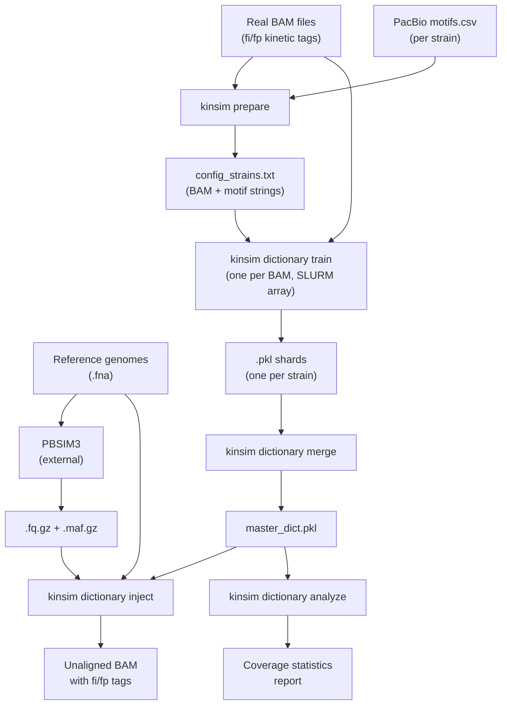

# KinSim

<p align="center">
  
</p>

**PacBio kinetic signal simulator for metagenomic binning.**

KinSim learns species-specific IPD/PW distributions from real PacBio SMRT sequencing data, then injects realistic kinetic signals into synthetic reads generated by PBSIM3. The goal: prove that methylation-derived kinetic signatures improve metagenomic binning.

## How it works

PacBio sequencing captures two kinetic signals at every base: **IPD** (Inter-Pulse Duration) and **PW** (Pulse Width). These signals vary depending on the local sequence context (11-mer) and DNA methylation state. KinSim exploits this by:

1. **Training** a model from real BAM files — learning the statistical distribution of IPD/PW for each 11-mer + methylation state.
2. **Injecting** sampled signals onto PBSIM3 synthetic reads, using the reference genome to resolve context for edge bases.

Two generation modes are planned:

| Mode | Status | Method |
|---|---|---|
| **Dictionary** | Implemented | Gaussian sampling from per-kmer accumulators |
| **cGAN** | Training ready | Conditional GAN for complex signal distributions |

Both modes share the same **prepare** step and motif format.

### Pipeline overview (dictionary mode)



## Installation

### Option A: Install as a package (recommended)

```bash
git clone https://github.com/<user>/KinSim.git
cd KinSim
pip install -e .
```

After installing, the `kinsim` command is available from anywhere:

```bash
kinsim prepare ...
kinsim dictionary train ...
```

### Option B: Run without installing

```bash
git clone https://github.com/<user>/KinSim.git
cd KinSim
pip install numpy pysam
```

All commands must be run **from the repository root** (`KinSim/`) using `python -m kinsim`:

```bash
cd /path/to/KinSim
python -m kinsim prepare ...
python -m kinsim dictionary train ...
```

### Help

All commands support `-h` for detailed usage:
```bash
kinsim -h
kinsim prepare -h
kinsim dictionary -h
kinsim dictionary train -h
kinsim dictionary inject -h
kinsim cgan -h
kinsim cgan train -h
```

---

## Part 1 — Shared tools (all modes)

### Prepare: parse PacBio motifs.csv into config

Create an input file listing BAM/CSV pairs (alternating lines):
```
/path/to/strain1.bam
/path/to/strain1/motifs.csv
/path/to/strain2.bam
/path/to/strain2/motifs.csv
```

Parse it:
```bash
kinsim prepare pairs.txt config_strains.txt
```

This filters motifs (`fraction >= 0.40`, `nDetected >= 20`), resolves ambiguous `modified_base` types, and outputs:
```
/path/to/strain1.bam
m6A,GCCGATC,5,3551;m6A,CTGAAG,5,2891
/path/to/strain2.bam
m6A,CACAGGNC,4,1539;m4C,GYCTGVNCRC,3,922
```

You can also parse a single CSV directly:
```bash
kinsim motifs /path/to/motifs.csv
```

### Motif string format

Semicolon-delimited entries: `MOD_TYPE,IUPAC_MOTIF,POS[,nDetected]`

```
m6A,GCCGATC,5,3551;m4C,CCWGG,1,922;m5C,RGATCY,4,1138
```

- **MOD_TYPE**: `m6A`, `m4C`, or `m5C`
- **IUPAC_MOTIF**: supports ambiguity codes (R, Y, W, S, K, M, B, D, H, V, N)
- **POS**: 0-based position of modified base within the motif
- **nDetected**: optional 4th field, used by cGAN mode, ignored by dictionary mode

Both forward and reverse-complement strands are scanned automatically.

---

## Part 2 — Dictionary mode

The dictionary mode uses a statistical approach: for each 11-mer + methylation state, it stores a running accumulator `[n, sum_ipd, sum_ipd2, sum_pw, sum_pw2]` from which mean and variance are derived. Signal injection samples from a Gaussian distribution.

### Train: build the kinetic dictionary

```bash
# Single BAM -> one shard
kinsim dictionary train reads.bam \
    "m6A,GCCGATC,5,3551;m6A,CTGAAG,5,2891" output.pkl

# Merge all shards into master dictionary
kinsim dictionary merge /path/to/shards/ master_dict.pkl
```

### Inject: paint signals onto synthetic reads

Requires PBSIM3 output (`.fq.gz`, `.maf.gz`) and the **reference genome** (needed to resolve 11-mer context for the first/last 5 bases of each read via the MAF alignment coordinates):

```bash
kinsim dictionary inject \
    reads.fq.gz reads.maf.gz ref.fna master_dict.pkl \
    "m6A,GCCGATC,5,3551" output.bam
```

Add `--linear` for non-circular genomes. Output is an unaligned BAM with `fi` (IPD) and `fp` (PW) tags.

### Analyze: inspect dictionary coverage

```bash
kinsim dictionary analyze master_dict.pkl
```

Reports per-methylation-state: % of 4^11 possible 11-mers covered, mean/median/min/max sample counts.

---

## Part 3 — cGAN mode (in progress)

Will use a Conditional Generative Adversarial Network to generate kinetic signals for non-Gaussian distributions. Shares the same prepare step, motif format, and the `nDetected` 4th field for training weights.

### Train: extract raw samples for GAN training

Unlike dictionary mode (which stores running accumulators), cGAN mode collects **raw (IPD, PW) observations** per 11-mer context. These are needed to train the conditional generator on the full distribution shape.

```bash
# Single BAM -> one shard (reservoir-sampled to --max-samples per context)
kinsim cgan train reads.bam \
    "m6A,GCCGATC,5,3551;m6A,CTGAAG,5,2891" output_cgan.pkl

# Merge all shards into master training set
kinsim cgan merge /path/to/shards/ master_cgan.pkl
```

Inject and analyze for cGAN mode are not yet implemented.

---

## SLURM (HPC cluster)

All steps below use the **dictionary mode**. Adapt module paths for cGAN when available.

The train script handles both phases (train shards + merge) in a single file. SLURM detects which phase to run based on whether `--array` is set:

```bash
# 0. Prepare config (local, fast)
kinsim prepare pairs.txt config_strains.txt

# 1. Train + merge (two submissions, one script)
TRAIN=$(sbatch --parsable --array=1-53 \
    slurm_kinsim/kinsim_train.slurm config_strains.txt shards/ master_dict.pkl)
sbatch --dependency=afterok:$TRAIN \
    slurm_kinsim/kinsim_train.slurm config_strains.txt shards/ master_dict.pkl

# 2. Inject — array job, one task per simulated genome
sbatch --array=1-10 \
    slurm_kinsim/kinsim_inject.slurm config_inject.txt /inject/output/

# 3. Analyze
sbatch slurm_kinsim/kinsim_analyze.slurm master_dict.pkl
```

To merge two existing master dictionaries (e.g. adding new training data):
```bash
kinsim dictionary merge dir_with_both_pkls/ combined_master.pkl
```

### Memory usage (dictionary mode)

| Step | Peak RAM | What dominates |
|---|---|---|
| Train | 1-2 GB | Dictionary growth (reads streamed via pysam) |
| Merge | 2-3 GB | Master dictionary in memory |
| Inject | 2-4 GB | Dictionary (~260 bytes/entry x millions of entries) |
| Analyze | 1-2 GB | Dictionary loaded for stats |

## Repository structure

```
kinsim/                     Python package
  __main__.py               CLI entry point (kinsim <command>)
  encoding.py               Shared: 22-bit kmer encoding, accumulator stats
  motifs.py                 Shared: IUPAC regex, motif scanning, CSV parser
  prepare.py                Shared: BAM+CSV pairs -> config file generator
  dictionary/               Dictionary mode (implemented)
    train.py                Build dictionary from BAM + merge shards
    inject.py               Inject signals using MAF + reference context
    analyze.py              Dictionary coverage statistics
  cgan/                     cGAN mode (planned)

slurm_kinsim/               SLURM job scripts (dictionary mode)
cluster/                    HPC infrastructure (legacy scripts, test data)
  config.yaml               Central cluster paths
  Tests/                    Legacy scripts, test data, development artifacts
```

## Requirements

- Python >= 3.10
- numpy
- pysam
- PBSIM3 (external, for read simulation)
- pyyaml (optional, for cluster config parsing)

## License

MIT

## Citation

If you use KinSim in your research, please cite:

Roberts RJ, Vincze T, Posfai J, Macelis D. REBASE--a database for DNA restriction and modification: enzymes, genes and genomes. Nucleic Acids Res. 2015 Jan;43(Database issue):D298-9. doi: 10.1093/nar/gku1046.
